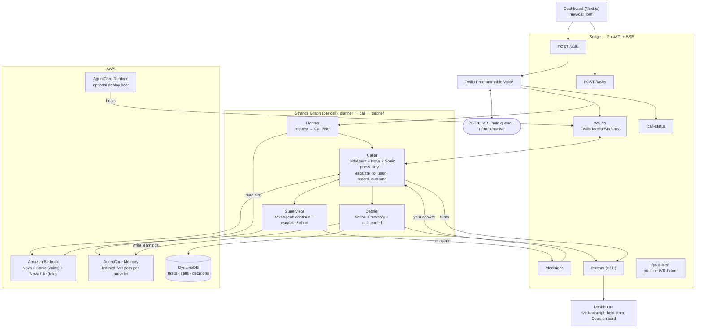

# Holdline

**The agent that holds the line so you don't have to.**

Hand Holdline a phone call you've been dreading — *"cancel my gym membership,
effective month-end, get me a confirmation number, don't accept a pause or a
downgrade."* It places a **real** phone call, works through the phone tree, waits
on hold, talks to the representative, and interrupts you — mid-call, while it
keeps the line open — **only** when the rep pushes something outside the limits
you set.

Built for the **Agents for Humans Hackathon** with the **Strands Agents SDK** —
*Everyday Agents* track.

- **Problem** — everyone has a call rotting on their to-do list for weeks. The
  task isn't hard; it's 25 minutes of hold music, a menu that changes, and a rep
  trained not to let you cancel.
- **Who it's for** — anyone who dreads phone admin, and especially people for
  whom a phone call is a real barrier: anxiety, a second language, a disability,
  or a caregiver with no spare 25 minutes.
- **Why it matters** — this is exactly the repetitive, judgment-heavy busywork an
  agent should absorb: run the mechanical 95% autonomously, and surface the 5%
  that is a genuine decision — without hanging up.

## Why it's an agent, not a script

A cancellation call is unscripted. The menu changes. You get transferred to the
wrong department. Whether a retention counter-offer is worth taking is a judgment
call that belongs to **you**. Holdline needs a live speech-to-speech model to
hold the conversation, a supervisor watching for the moment a boundary is
crossed, and a way to pause and ask you *while the rep is still on the line*.

## Architecture



(Also at [`docs/architecture.png`](docs/architecture.png) /
[`docs/architecture.mmd`](docs/architecture.mmd). Component-level detail in
[`docs/architecture.md`](docs/architecture.md).)

### The four Strands agents

| Agent | Kind | When | Does |
|---|---|---|---|
| **Planner** | `Agent` + structured output (Bedrock) | pre-call | plain-language request → **Call Brief**: objective, identity info, `may_agree_to` / `must_escalate` boundaries, success criteria, IVR hint from memory |
| **Caller** | `BidiAgent` + **Amazon Nova 2 Sonic** | the call | live voice conversation; tools `press_keys` (DTMF), `escalate_to_user`, `lookup_task_context`, `record_outcome`, `stop_conversation` |
| **Supervisor** | `Agent` (Bedrock) | every few seconds | reads the transcript vs. the Brief → `continue` / `escalate(question, options)` / `abort(reason)` — the safety net if the Caller doesn't self-escalate |
| **Scribe** | `Agent` + structured output (Bedrock) | post-call | transcript → summary, confirmation number, follow-up draft, and the **learned IVR path** written back to provider memory |

Composed as a **Strands `Graph`** — `planner → call → debrief` — where the `call`
node runs the Caller and Supervisor concurrently on a shared transcript bus.

### Stack

**Strands Agents SDK** (`BidiAgent`, `Graph`, `MultiAgentBase`, structured
output) · **Amazon Nova 2 Sonic** (speech-to-speech) · **Amazon Bedrock**
(Nova Lite for the text agents) · **Twilio** Programmable Voice + Media Streams ·
**Amazon Bedrock AgentCore** Memory + Runtime (optional deploy) · **DynamoDB**
(or an in-process backend) · **FastAPI** + Server-Sent Events · **Next.js**
dashboard built entirely from shadcn component registries · Strands
**OpenTelemetry** tracing.

## Nothing is simulated

Fictional org, real mechanisms. The demo target is a **practice IVR we host
ourselves** (`src/holdline/practice/`, `practice_ivr/README.md`) — a test
fixture, not a fake business. Every mechanism it exercises is real: a real PSTN
call, real DTMF tones, real speech-to-speech, a real hold queue, a real
retention conversation. Swap `PRACTICE_IVR_NUMBER` for any real number and the
agent behaves identically.

## Quickstart

Requires **Python 3.12** and **Node 20+**. AWS + Twilio are needed for a live
call; the dashboard and the whole pipeline run without them using in-process
backends.

```bash
git clone https://github.com/chirag405/holdline.git
cd holdline
python -m venv .venv && . .venv/Scripts/activate      # PowerShell: .venv\Scripts\Activate.ps1
pip install -e ".[dev]"
cp .env.example .env

# 1) backend — no AWS/Twilio needed for the shell
STATE_BACKEND=memory python scripts/run_bridge.py      # http://localhost:8000

# 2) dashboard
cd frontend && npm install && cp .env.local.example .env.local && npm run dev
#                                                                  http://localhost:3000
```

For a **real call**: set AWS creds (Bedrock **Nova 2 Sonic** access, `us-east-1`)
and `TWILIO_*` in `.env`, expose the bridge with a tunnel
(`cloudflared tunnel --url http://localhost:8000` → `PUBLIC_WS_URL`), point a
second Twilio number's voice webhook at `<tunnel>/practice/entry`, then run the
scenarios:

```bash
python scripts/seed_scenarios.py        # a: clean cancel · b: retention→hold firm · c: escalation→accept
```

Full details and the day-by-day build log: [`SETUP.md`](SETUP.md).
**Running it for real / submitting it:** [`docs/YOUR-TODO.md`](docs/YOUR-TODO.md)
— a top-to-bottom runbook for accounts, a live call, the video, and Devpost.
AgentCore Runtime deploy: [`deploy/agentcore/README.md`](deploy/agentcore/README.md).
Tracing: [`docs/observability.md`](docs/observability.md).

## Tests

```bash
pytest -q                        # 55 tests, no AWS/Twilio/Node needed
python scripts/verify_day8.py    # offline end-to-end check (each day has one)
```

## Ethics & consent

- Holdline **identifies itself as an automated assistant** calling on the account
  holder's behalf whenever asked.
- The demo target is the **self-hosted practice IVR**. No third party is called
  without consent.
- Call recording is **off by default** for any number we do not control, and
  follows the stricter of the two parties' jurisdictions.

## License

[MIT](LICENSE) © 2026 Chirag Dhouni
