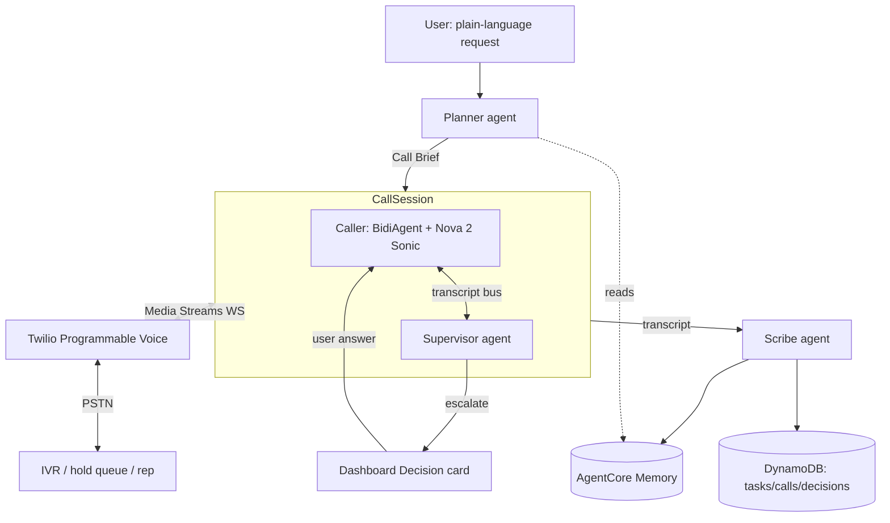

# Holdline — Architecture

> Diagram PNG (`architecture.png`) is produced from the mermaid below on Day 9.

## Components

### Agents (Strands)

| Agent | Type | Runs | Responsibility |
|---|---|---|---|
| **Planner** | text `Agent`, structured output | once, pre-call | Turn a plain-language request + optional fields into a **Call Brief**: `objective`, `identity_info`, `boundaries {may_agree_to, must_escalate}`, `success_criteria`, `ivr_hint`, `default_on_timeout`. Reads AgentCore Memory for a known provider's IVR path. |
| **Caller** | `BidiAgent` + Nova 2 Sonic | during the call | Live voice conversation. Tools: `send_dtmf`, `escalate_to_user`, `lookup_task_context`, `record_outcome`, `end_call`. |
| **Supervisor** | text `Agent` | every ~8 s during the call | Reads the running transcript against the Brief; returns `{continue \| escalate(question, options) \| abort(reason)}`. Safety net + the multi-agent story. |
| **Scribe** | text `Agent` | once, post-call | Transcript → `summary`, `confirmation_number`, `outcome_status`, `follow_up_draft`, `follow_up_date`. Writes the learned IVR path back to Memory. |

Orchestration: Strands `Graph` — `Planner → CallSession → Scribe`. `CallSession` is
a custom node that runs Caller (`BidiAgent`) and Supervisor (`Agent`) concurrently
on a shared asyncio **transcript bus**.

### Telephony bridge (`src/holdline/telephony/`)

- `POST /calls` → Twilio REST `calls.create` with TwiML `<Connect><Stream url=wss://…/ts>`.
- WS `/ts`: Twilio `media` frames (μ-law 8 kHz base64) → PCM16 16 kHz → Nova Sonic
  input; Nova Sonic output (PCM 24 kHz) → μ-law 8 kHz → Twilio `media`. Barge-in →
  Twilio `clear`.
- `send_dtmf`: synthesized DTMF dual-tones injected into the media stream (primary)
  or Twilio REST call-update `<Play digits>` (fallback).

### Escalation (the human-in-the-loop)

On `escalate`: Caller speaks a holding phrase and goes quiet → write a `decisions`
row → push to the dashboard Decision card (question + options + countdown) → wait
≤ 90 s for the user's answer → inject answer into Caller context → resume. Timeout →
`Brief.default_on_timeout`. The line stays open the whole time.

### State (DynamoDB, `src/holdline/state/`)

| Table | Key fields |
|---|---|
| `holdline-tasks` | `task_id`, request text, fields, `brief` (JSON), `status` |
| `holdline-calls` | `call_id`, `task_id`, `transcript`, `recording_url`, `outcome`, `confirmation_number`, timings |
| `holdline-decisions` | `decision_id`, `call_id`, `question`, `options`, `answer`, `resolved_at` |

### Memory (AgentCore, `src/holdline/memory/`)

- `provider_profiles`: company → IVR path, hold behaviour, retention tactics seen.
- `user_accounts`: masked account identifiers per provider.

## Flow

